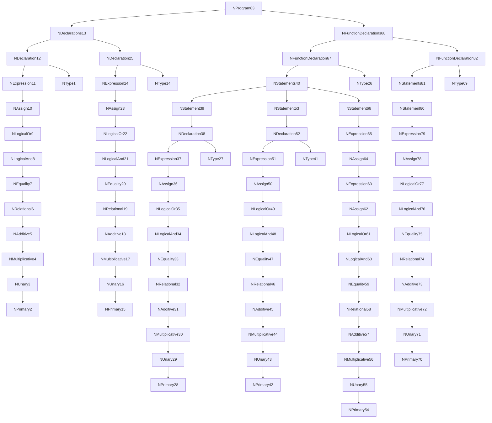

#### 
###### 

```mermaid
graph TD;
	NUnary3-->NPrimary2;
	NMultiplicative4-->NUnary3;
	NAdditive5-->NMultiplicative4;
	NRelational6-->NAdditive5;
	NEquality7-->NRelational6;
	NLogicalAnd8-->NEquality7;
	NLogicalOr9-->NLogicalAnd8;
	NAssign10-->NLogicalOr9;
	NExpression11-->NAssign10;
	NDeclaration12-->NType1;
	NDeclaration12-->NExpression11;
	NDeclarations13-->NDeclaration12;
	NUnary16-->NPrimary15;
	NMultiplicative17-->NUnary16;
	NAdditive18-->NMultiplicative17;
	NRelational19-->NAdditive18;
	NEquality20-->NRelational19;
	NLogicalAnd21-->NEquality20;
	NLogicalOr22-->NLogicalAnd21;
	NAssign23-->NLogicalOr22;
	NExpression24-->NAssign23;
	NDeclaration25-->NType14;
	NDeclaration25-->NExpression24;
	NDeclarations13-->NDeclaration25;
	NUnary29-->NPrimary28;
	NMultiplicative30-->NUnary29;
	NAdditive31-->NMultiplicative30;
	NRelational32-->NAdditive31;
	NEquality33-->NRelational32;
	NLogicalAnd34-->NEquality33;
	NLogicalOr35-->NLogicalAnd34;
	NAssign36-->NLogicalOr35;
	NExpression37-->NAssign36;
	NDeclaration38-->NType27;
	NDeclaration38-->NExpression37;
	NStatement39-->NDeclaration38;
	NStatements40-->NStatement39;
	NUnary43-->NPrimary42;
	NMultiplicative44-->NUnary43;
	NAdditive45-->NMultiplicative44;
	NRelational46-->NAdditive45;
	NEquality47-->NRelational46;
	NLogicalAnd48-->NEquality47;
	NLogicalOr49-->NLogicalAnd48;
	NAssign50-->NLogicalOr49;
	NExpression51-->NAssign50;
	NDeclaration52-->NType41;
	NDeclaration52-->NExpression51;
	NStatement53-->NDeclaration52;
	NStatements40-->NStatement53;
	NUnary55-->NPrimary54;
	NMultiplicative56-->NUnary55;
	NAdditive57-->NMultiplicative56;
	NRelational58-->NAdditive57;
	NEquality59-->NRelational58;
	NLogicalAnd60-->NEquality59;
	NLogicalOr61-->NLogicalAnd60;
	NAssign62-->NLogicalOr61;
	NExpression63-->NAssign62;
	NAssign64-->NExpression63;
	NExpression65-->NAssign64;
	NStatement66-->NExpression65;
	NStatements40-->NStatement66;
	NFunctionDeclaration67-->NType26;
	NFunctionDeclaration67-->NStatements40;
	NFunctionDeclarations68-->NFunctionDeclaration67;
	NUnary71-->NPrimary70;
	NMultiplicative72-->NUnary71;
	NAdditive73-->NMultiplicative72;
	NRelational74-->NAdditive73;
	NEquality75-->NRelational74;
	NLogicalAnd76-->NEquality75;
	NLogicalOr77-->NLogicalAnd76;
	NAssign78-->NLogicalOr77;
	NExpression79-->NAssign78;
	NStatement80-->NExpression79;
	NStatements81-->NStatement80;
	NFunctionDeclaration82-->NType69;
	NFunctionDeclaration82-->NStatements81;
	NFunctionDeclarations68-->NFunctionDeclaration82;
	NProgram83-->NDeclarations13;
	NProgram83-->NFunctionDeclarations68;
```
#### 
###### 
------